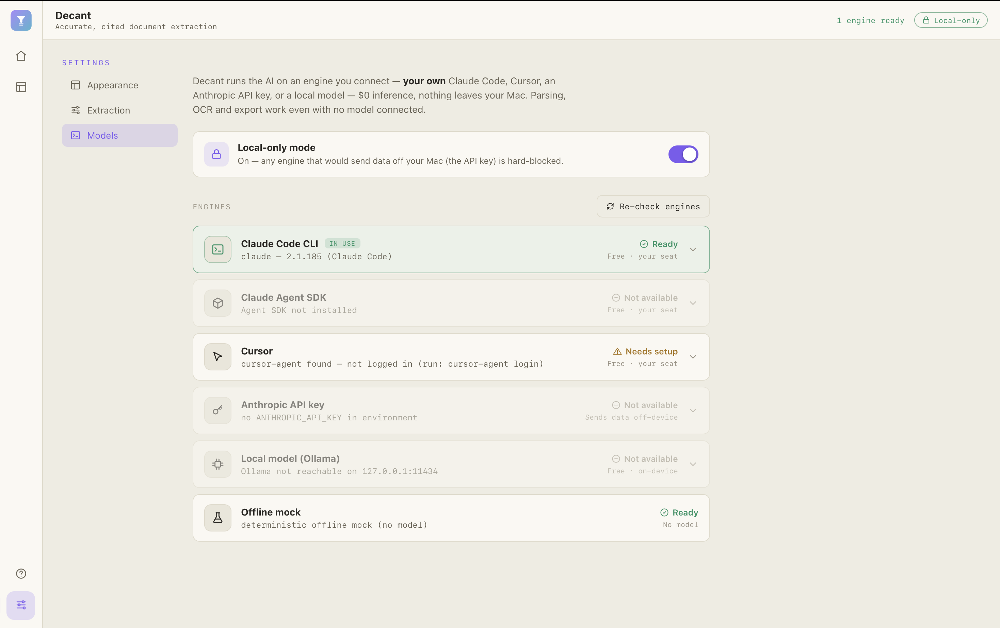
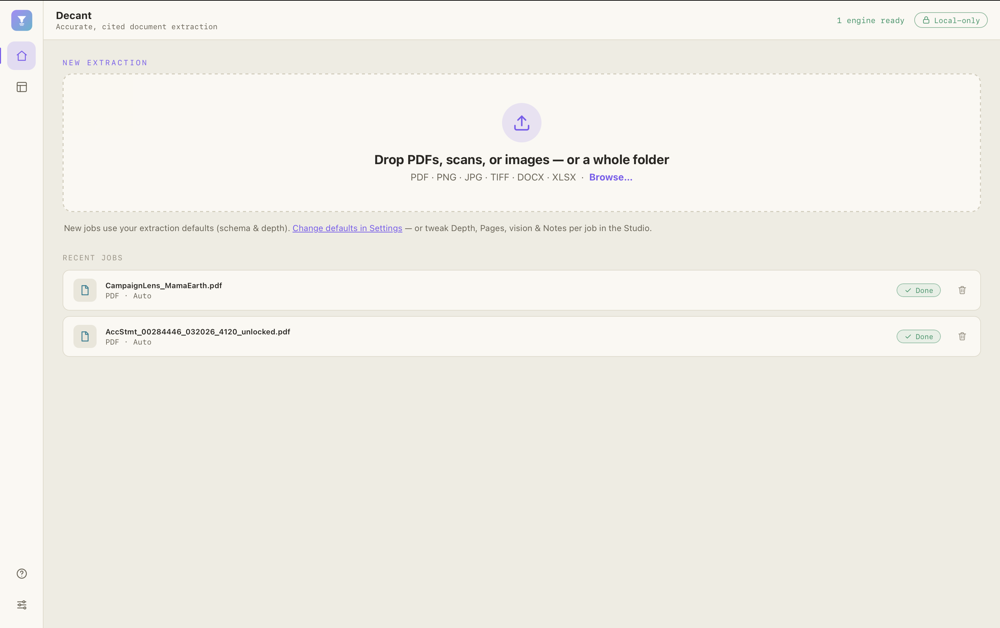
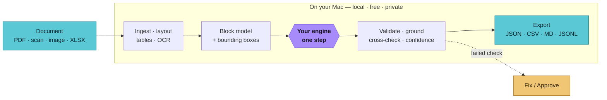

# Hey, this is Decant.

Decant turns messy documents — PDFs, scans, photos, spreadsheets — into clean, structured data
(JSON/CSV), and shows you *exactly* where on the page every value came from. It runs on your Mac and
uses an AI engine you already have — Claude Code, Cursor, an Anthropic API key, or a local model — so
inference costs you nothing and your documents never leave your machine.

I built it because doc extraction tools are either cloud services that upload your files and bill per
page, or thin wrappers that hand the whole job to a model and hope. Decant does the opposite: your
machine does the heavy lifting (render, layout, tables, OCR, validation, citations), the model does
one focused step, and every value is checked against the page it was pulled from.




## Get started

Download `Decant_<version>_aarch64.dmg` from [Releases](../../releases/latest), drag it to
Applications, and open it. First launch: right-click the app → **Open** (until it's notarized on your
machine). Then connect your AI engine in **Settings ▸ Models** — Decant auto-detects Claude Code,
Cursor, an API key, or a local model and shows you what's ready.

That's it. Drop a document on the Home screen and it opens in the Studio.



## What it does

Three things, all from the same local layout model:

- **Extract** — the fields and tables you want (auto-discovered, or via a schema you define). Each value is highlighted on the rendered page; click a field to jump to its box and back. Export JSON or CSV.
- **Parse** — the whole document as clean Markdown, with every block typed (heading / table / text / figure).
- **Chunk** — retrieval-ready chunks with page provenance for RAG. Export JSONL.

Low-confidence or inconsistent values get flagged so you can **Fix** (edit inline) or **Approve** them — nothing is silently trusted.


## Use it from the CLI

The engine ships as a self-contained binary, `decantd` (it's inside the app at
`Decant.app/Contents/MacOS/decantd`, or download it from Releases).

```bash
DECANTD=./decantd-aarch64-apple-darwin   # chmod +x once

$DECANTD detect                                    # which engines are ready
$DECANTD extract invoice.pdf invoice.schema.json   # → JSON with citations
$DECANTD extract invoice.pdf invoice.schema.json --csv          # CSV (tables → rows)
$DECANTD extract invoice.pdf invoice.schema.json --local-only   # block all egress
$DECANTD parse doc.pdf                              # Markdown + block model
$DECANTD chunk doc.pdf                              # JSONL for RAG
```

A schema is plain JSON; the field descriptions double as instructions to the model:

```json
{ "name": "Invoice", "fields": [
  { "name": "invoice_number", "type": "string",   "required": true, "description": "Top-right ID like INV-..." },
  { "name": "invoice_date",   "type": "date",     "required": true },
  { "name": "line_items",     "type": "table",    "description": "rows: item, qty, unit, amount" },
  { "name": "total",          "type": "currency", "required": true }
] }
```

Types: `string · number · date · currency · enum · boolean · table`. Type, required, regex and enum
checks run locally; failures go to the needs-attention queue.

## How it works

Your machine does the work end-to-end; the model does one focused step in the middle.



Every extracted value comes back as `{ value, confidence, citations: [{ block_id, page, bbox, valid }] }`.
"Grounding" means the value is checked against the text of the block it cites — if it isn't actually
there, the citation is marked invalid and the field is flagged. Cross-field checks (sums, totals, date
order) and type normalization (dates → ISO, currency → number) run locally at no cost.

The AI step runs on an engine you connect, in priority order:
`claude-cli → agent-sdk → cursor → local (Ollama) → api-key → dry-run (offline mock)`.
"Local-only" mode hard-blocks anything that would send data off-device.

## Project structure

```
app/         React + Tauri desktop UI (Home · Studio · Settings · Guide)
src-tauri/   Tauri shell (Rust) — drives the engine binary, builds the .dmg
landing/     the website (static)
scripts/     check-connection.sh — verify the round-trip through your engine
docs/        use cases · accuracy · security · screenshots
```

The `decantd` engine (the document pipeline) ships as a prebuilt binary — bundled in the app and
attached to each release. This repo is the open-source shell around it.

## Build the shell from source

```bash
cd app && npm install && npm run dev        # UI in the browser, no native toolchain

# native app (one-time toolchain)
brew install rust
npm i -g @tauri-apps/cli@^2
xcode-select --install

# drop the engine binary in place (from Releases), then run/build
mkdir -p src-tauri/binaries
cp /path/to/decantd-aarch64-apple-darwin src-tauri/binaries/ && chmod +x src-tauri/binaries/*
tauri dev                                    # or: tauri build --bundles dmg
```

## Contributing

Issues and PRs welcome — see [CONTRIBUTING.md](CONTRIBUTING.md). The shell is **AGPL-3.0**
([LICENSE](LICENSE)); the bundled `decantd` engine binary is a separate component under its own terms.

macOS (Apple Silicon) first. More in [docs/USE-CASES.md](docs/USE-CASES.md),
[docs/ACCURACY.md](docs/ACCURACY.md), and [docs/SECURITY.md](docs/SECURITY.md).
